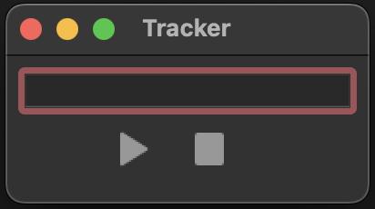

# Task Tracker Application

This is a task tracking application built with a FastAPI backend, PostgreSQL database, and a React frontend with TypeScript. The application allows users to track their tasks, record start and end times, and calculate the duration of each task. Additionally, users can see their tasks using a GraphQL API.

## Features
- **Task Tracking**: Start and stop tasks with a description via Desktop GUI.
- **Time Duration Calculation**: Automatically calculate the duration of tasks.
- **GraphQL API**: Query tasks within a specified time period.
- **React Frontend**: View and query tasks through a user-friendly web interface.

## Technologies Used

- **Backend**: Python 3.11.3, FastAPI, SQLAlchemy, PostgreSQL, Pydantic
- **Frontend**: React, TypeScript
- **GraphQL**: Graphene (Python library for GraphQL)
- **DesktopGUI**: Python 3.11.3, PyQT5

## Installation

1. **Clone the Repository**:

    ```bash
    git clone https://github.com/egor-bondarev/Tracker.git
    cd Tracker
    ```

2. **Run Backend services and Postgres in Docker**:

    ```bash
    make run_tracker
    ```

3. **Run the React Application**:

    ```bash
    cd web_ui/tracker-client
    npm start
    ```
    Web UI will be available on http://localhost:3000

4. **Run Desktop GUI**:

    ```bash
    cd ../..
    cd ./desktop_gui
    python ./main.py
    ```
    

## Usage

1. On desktop GUI type your task description and press Start. 
2. After finishing your task press Stop.
3. If you forgot to start your task, you may type description and press Stop. In this case start time will be a finish time from your previous task.
4. To see your tasks list go to web ui (http://localhost:3000), set start and finish time by mask "YYYY-MM-DD hh:mm:ss" and click "Show Tasks".

### Architecture
#### **Record service:**
This service works with desktop gui and write data to database.

**API Endpoints:**

- **Start a new Task**: 
    ```
    POST /new/?is_task_finished=false
    ```

- **Finish started Task**: 
    ```
    POST /finish/
    ```

- **Start and Finish a new Task**: 
    ```
    POST /new/?is_task_finished=true
    ```

#### **Analytic service:**
This service works with web ui and show tasks list via GraphQL request.

**API Endpoints:**

- **Get Tasks from period**: 
```graphql
query GetTasksInPeriod($startDate: DateTime!, $endDate: DateTime!) {
    tasksInPeriod(start_date: $startDate, end_date: $endDate) {
        id
        description
        start_timestamp
        finish_timestamp
        duration
    }
}
```